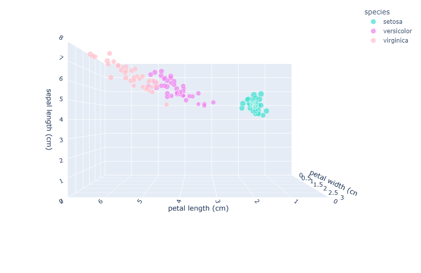

# NaRLA


For installation instructions and API documentation please refer to the [docs](https://multi-agent-networks.github.io/NaRLA/)


## Run main (RL task)
```bash 
narla main.py \
  --trial_settings.results_directory Results \
  --environment_settings.environment CART_POLE \
  --multi_agent_network_settings.layer_settings.neuron_settings.neuron_type POLICY_GRADIENT
```

## Run main (classification task)
```bash 
narla main_classification.py \
  --trial-settings.results-directory results_classification \
  --environment-settings.environment IRIS \
  --multi-agent-network-settings.layer-settings.neuron-settings.neuron-type DEEP_Q
```

## Execute runner
Run `main.py` with a product of all the settings
```bash 
narla scripts/run_jobs.py \
  --settings.trial_settings.results_directory RunnerResults \
  --environments CART_POLE \
  --gpus 0 1 2 3 \
  --jobs_per_gpu 5 \
  --learning_rates 0.01 0.001 0.0001 \
  --neuron_types DEEP_Q ACTOR_CRITIC POLICY_GRADIENT \
  --number_of_layers 1 2 3 4 5 6 7 8 9 10 \
  --number_of_neurons_per_layer 5 10 15
```

## Visualizing results
### Visualizing network performance (Cart-Pole environment)


https://github.com/HelenaFP/NaRLA/assets/73249743/ae2b1da6-9c46-4e0c-8f48-1c5bc314bb22


### Visualizing network performance (Iris dataset classification)


https://github.com/HelenaFP/NaRLA/assets/73249743/009b8148-5dfc-404b-807c-469e2d1a14fb


Ground truth: <br>




## Citation
This repository accompanies the paper [*Giving Up Control: Neurons as Reinforcement Learning Agents*](https://arxiv.org/abs/2003.11642)

```
@misc{ott2020giving,
    title={Giving Up Control: Neurons as Reinforcement Learning Agents},
    author={Jordan Ott},
    year={2020},
    eprint={2003.11642},
    archivePrefix={arXiv},
    primaryClass={cs.NE}
}
```
